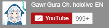

# VtuberSubscriptionButtonCollection

## Collection of vtuber subscription button

### 這個專案主要是蒐集Vtuber的訂閱按鈕，讓你可以快速的使用這些訂閱按鈕嵌入html中按鈕的與法如下

```html
<script src="https://apis.google.com/js/platform.js"></script>
<div class="g-ytsubscribe" data-channelid="UCoSrY_IQQVpmIRZ9Xf-y93g" data-layout="full" data-theme="dark" data-count="default"></div>
```

* data-channelid - 按鈕的頻道 ID。
* data-layout - 按钮格式。
  * default 顯示訂閱按鈕
  * full 顯示訂閱按鈕之外，還顯示頻道頭像和標題
* data-theme 指定該按鈕使用的配色方案
  * default
  * dark 主要用在深色的背景
* data-count 是否顯示頻道的訂閱人數
  * default 顯示
  * hidden 隱藏



按照上面語法你就會得到這個按鈕啦

你可以過來這個網頁看看實際的效果  
這個沒有特別排版就是看成效而以請不要介意XD  
順便確認你是不是DD (｡A｡)  
<https://huangyutse.github.io/VtuberSubscriptionButtonCollection/>

有其他問題請參考[Youtube官方文件](https://developers.google.com/youtube/subscribe?hl=zh-cn)

## 關於整理好的資料

* hololive  
Generation_0到5 : hololive JP零期到五期生  
Hololive_Gamers : hololive JP遊戲組  
Hololive_English : hololive EN  
Hololive_Indonesia_Generation_1到2 : hololive IN一期到二期生
  * 所有 .csv 檔包含以下欄位
    * Name : Vtuber英文名
    * Debut date : 出道日期
    * Youtube channel id : 頻道id (用於api時所需資料)
    * Youtube subscription button : 頻道訂閱鈕的html語法  
  * 所有 .xlsx 檔包含以下欄位
    * Name : Vtuber英文名
    * Debut date : 出道日期
    * Youtube channel id : 頻道id (用於api時所需資料)
    * Youtube subscription button : 頻道訂閱鈕的html語法
    * Japanese name : Vtuber日文名
    * Youtube channel name : 頻道標題名稱
    * Taiwanese name : 繁體中文名 (如果沒有以英文替代)
    >如果該項資料為 - 號代表從缺，有可能是已經畢業了，使用時請注意
